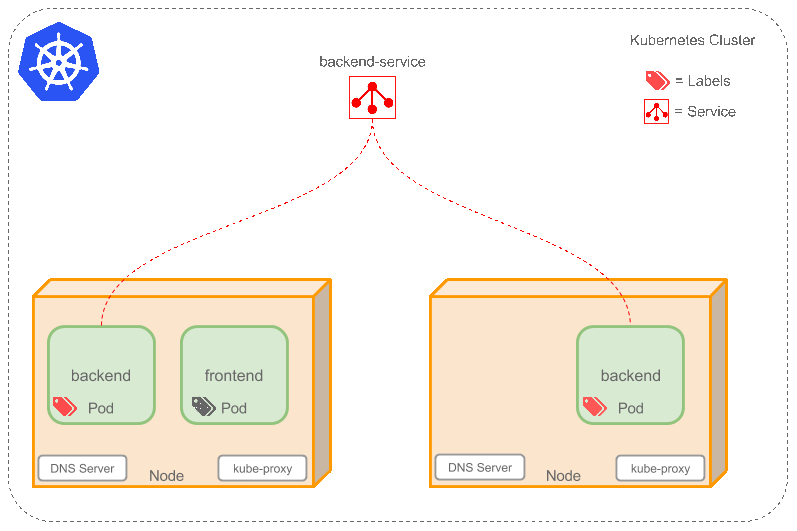

## Kubernetes

是容器集群管理系统，可以实现容器集群的自动化部署、自动扩容缩容、维护等功能。

> 容器编排：管理容器的生命周期

k8s概念：

- [x] `cluster` ：is a group of nodes, they can be physical servers or virtual machines that has the Kubernetes platform installed.

- [x] `Pod`:the smallest deployable units in Kubernetes that can be created, scheduled and managed. It's all about pods, if you deploy a single container it will be deployed in its own Pod.

  - [ ] Pods are scheduled to Nodes and contain a group of co-located Containers and Volumes. Containers in the same Pod share the same network namespace and can communicate with each other using localhost. Pods are considered to be ephemeral rather than durable entities. 

  - **If Pods are ephemeral how can I persist my container data across container restarts?** Well, Kubernetes supports the concept of [Volumes](http://kubernetes.io/v1.1/docs/user-guide/volumes.html) so you can use a Volume type that is persistent.
  - **Do I create Pods manually, what if I want to create a few copies of the same container do I have to create each one individually?** You can create individual Pods manually, but you can use a Replication Controller to rollout multiple copies using a Pod template, which will be explained below.

  - **If Pods are ephemeral and their IP address might change if they get restarted how can I reliability reference my backend container from a frontend container?** In this case you will use a Service as explained below.

- [ ] `Labels`: As you can see from the diagram, some of the Pods have labels (). A Label is a key/value pair attached to Pods and **convey user-defined attributes**. For example you might create a ‘tier’ and an ‘app’ tags to tag your containers by applying the Labels (**tier=frontend, app=myapp**) to your frontend Pods and Labels (**tier=backend, app=myapp**) to backend Pods. You can then use [Selectors](http://kubernetes.io/v1.1/docs/user-guide/labels.html#label-selectors) to select Pods with particular Labels and apply Services or Replication Controllers to them.

- [ ] `Replication Controllers` : ensure the specified number of Pod “replicas” are running at any one time. If you created a Replication Controller for a Pod and specified 3 replicas, it will create 3 Pods and will continuously monitor them. If one Pod dies then the Replication Controller will replace it to maintain a total count of 3. If the Pod that died comes back then you have 4 Pods, consequently the Replication Controller will terminate one so the total count is 3. If you change the number of replicas to 5 on the fly, the Replication Controller will immediately start 2 new Pods so the total count is 5. 

  - [ ] When creating a Replication Controller you need to specify two things:
    1. **Pod Template**: the template that will be used to create the Pods replicas.
    2. **Labels**: the labels for the Pods that this Replication Controller should monitor.

- [ ] `Services`: **abstraction** that defines a set of Pods and a policy to access them. Services find their group of Pods using Labels. Because Services are abstraction you don’t usually see them in diagrams which makes the concept hard to understand.

Now, imagine you have 2 backend Pods and you defined a backend Service named ‘*backend-service*’ with label selector (**tier=backend, app=myapp**). Service *backend-service* will facilitate two key things:

- A cluster-local [DNS](http://kubernetes.io/v1.1/docs/admin/dns.html) entry will be created for the Service so your frontend Pod only need to do a DNS lookup for hostname ‘backend-service’ this will resolve to a stable IP address that your frontend application can use.

- So now your frontend has got an IP address for the backend-service, but which one of the 2 backend Pods will it access? The Service will provide transparent load balancing between the 2 backend Pods and forward the request to any one of them (see the animated diagram below). This is done by using a proxy (kube-proxy) that runs on each Node. More technical details [here](http://kubernetes.io/v1.1/docs/user-guide/services.html#virtual-ips-and-service-proxies).

> There is a special type of Kubernetes Services called ‘[LoadBalancer](http://kubernetes.io/v1.1/docs/user-guide/services.html#type-loadbalancer)’, which is used as an external load balancer to balance traffic between a number of Pods. Handy for load balancing Web traffic for example.

- [x] `Node`: A [node](http://kubernetes.io/v1.1/docs/admin/node.html) (the orange box) is a physical or virtual machine that acts as a Kubernetes worker, used to be called Minion. Each node runs the following key Kubernetes components:
  - **Kubelet**: is the primary node agent.
  - [**kube-proxy**](http://kubernetes.io/v1.1/docs/admin/kube-proxy.html): used by Services to proxy connections to Pods as explained above.
  - **Docker or Rocket**. The container technology that Kubernetes uses to create containers.
- [ ] `Master`: The cluster has a [Kubernetes Master](http://kubernetes.io/v1.1/docs/admin/high-availability.html#master-elected-components) (the box in purple). The Kubernetes Master provides a unified view into the cluster and has a number of components such the Kubernetes API Server. The API Server provides a REST endpoint that can be used to interact with the cluster. The master also includes the Replication Controllers used to create and replicate Pods.

- [ ] `master`: 集群主节点，相当于人类的大脑，一切行为由大脑调配。主要负责分配和调度任务。决定将应用放在哪里去执行。

## 集群

Cluster是一组节点，这些节点可以是物理服务器或者虚拟机，之上安装了Kubernetes平台。下图是一个简要的架构图。

上图中有以下组件：

- `Pod`: 包含一组容器和卷，同一个Pod里的容器共享同一个网络命名空间，可以使用localhost互相通信。
- `Container` 
- `Label` : 一些Pod有Label。一个Label是attach到Pod的一对键值对，用来传递用户定义的属性。
- `Replication Controller` 确保任意时间都有指定数量的Pod副本在运行。如果为某个pod创建了Replication Controller并且指定3个副本，它会创建3个Pod，并且持续监控他们。如果某个Pod不响应，那么Replication Controller会替换它，保持总数为3个。如果之前不响应的Pod恢复了，现在就有4个Pod了，那么Replication Controller会将其中一个终止保持总数为3。如果在运行中将副本总是改为5，那么Replication Controller会立刻启动2个新Pod，保证总数为5.
  - 当创建Replication Controller时，需要指定两个东西：
    1. Pod模板：用来创建Pod的副本
    2. Label：Replication Controller需要监控的pod的标签
- `Service`
- `Node`
- `Kubernetes Master`

